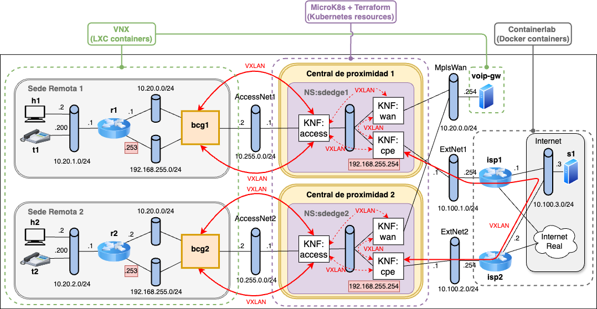
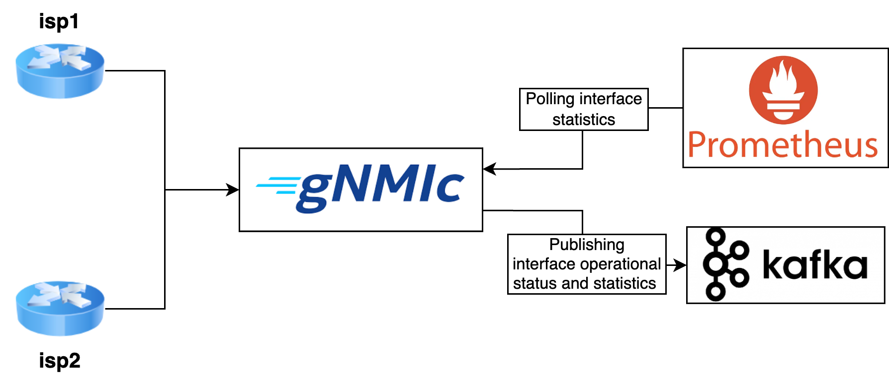
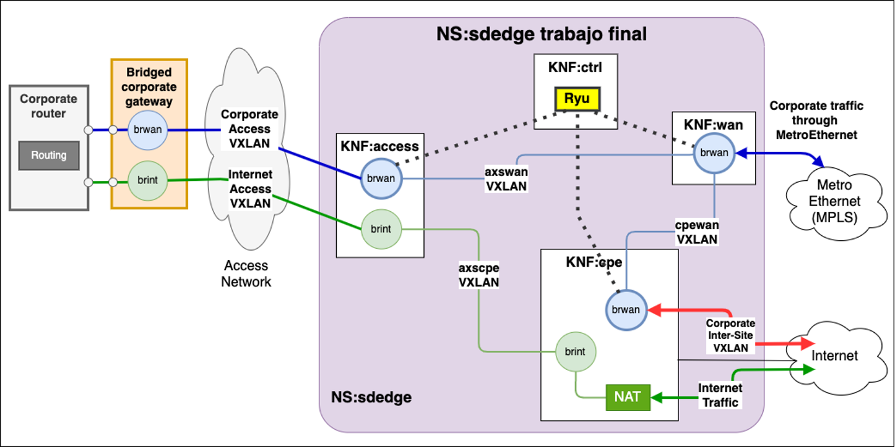

> **RDSV/SDNV**
>
> Curso 2025-26
> 
<!-- omit from toc -->
Reto RDSV/SDNV - Recomendaciones sobre el trabajo final
=================================================================

> Última actualización: 04 de diciembre de 2025 (16:12)
<!-- omit from toc -->
- [1. Preparación de la máquina virtual y arranque de escenario de red](#1-preparación-de-la-máquina-virtual-y-arranque-de-escenario-de-red)
  - [1.1 Configuración inicial del entorno](#11-configuración-inicial-del-entorno)
    - [1.1.1 Instalación y arranque de la máquina virtual en el laboratorio](#111-instalación-y-arranque-de-la-máquina-virtual-en-el-laboratorio)
    - [1.1.1.alt Instalación y arranque de la máquina virtual en equipo propio](#111alt-instalación-y-arranque-de-la-máquina-virtual-en-equipo-propio)
    - [1.1.2 Preparación del entorno de trabajo](#112-preparación-del-entorno-de-trabajo)
  - [1.2. Arranque del escenario de red](#12-arranque-del-escenario-de-red)
- [2. Creación de repositorios propios](#2-creación-de-repositorios-propios)
  - [2.1 Directorio de trabajo](#21-directorio-de-trabajo)
  - [2.2 Repositorio público de imágenes Docker](#22-repositorio-público-de-imágenes-docker)
- [3. Configuración de stack de telemetría](#3-configuración-de-stack-de-telemetría)
- [4. Configuración de nuevo servicio de red *sdedge* con Terraform](#4-configuración-de-nuevo-servicio-de-red-sdedge-con-terraform)
- [5. Modificación de imágenes de contenedores](#5-modificación-de-imágenes-de-contenedores)
  - [5.1 Modificación de imágenes de contenedores Docker](#51-modificación-de-imágenes-de-contenedores-docker)
  - [5.2 Modificación de la imagen de los contenedores de los escenarios VNX](#52-modificación-de-la-imagen-de-los-contenedores-de-los-escenarios-vnx)
- [6. Partes opcionales](#6-partes-opcionales)
  - [6.1 Repositorio privado de imágenes Docker](#61-repositorio-privado-de-imágenes-docker)
  - [6.2 Grafana como servicio de visualización de datos de telemetría](#62-grafana-como-servicio-de-visualización-de-datos-de-telemetría)
  - [6.3 Switches de sedes remotas controlados por OpenFlow](#63-switches-de-sedes-remotas-controlados-por-openflow)
  - [6.4 IPv6 en red de acceso](#64-ipv6-en-red-de-acceso)
  - [6.5 Otras recomendaciones](#65-otras-recomendaciones)

# 1. Preparación de la máquina virtual y arranque de escenario de red

Para realizar el trabajo final se utilizará un entorno de trabajo similar al utilizado en la [práctica 3.2](rdsv-p32.md). La Figura 1 muestra el escenario de red que se va a desplegar en el trabajo final. De forma equivalente a la práctica 3.2, el escenario de red está formado por dos sedes remotas, y dos centrales de proximidad con acceso a Internet y al servicio MetroEthernet ofrecido sobre una red MPLS. Sin embargo, en este caso la red de acceso a Internet será virtualizada con al herramienta de virtualización Containerlab.


*Figura 1. Arquitectura general del trabajo final de RDSV/SDNV*

A continuación, de forma similar a como se hacía en la práctica 3.2, se detalla cómo preparar el entorno de trabajo para poder instalar y arrancar la máquina virtual requerida y desplegar la nueva versión del escenario de red propuesto en el trabajo final.

## 1.1 Configuración inicial del entorno
Para realizar el trabajo final se va a utilizar una máquina virtual distinta a la de las práctica 3.2. Deberá seguir una serie de pasos de configuración inicial, que se
detallan a continuación. 

### 1.1.1 Instalación y arranque de la máquina virtual en el laboratorio
Si utiliza un PC personal propio, acceda al apartado
[1.1.1.alt](#111alt-instalación-y-arranque-de-la-máquina-virtual-en-equipo-propio).

Si utiliza un PC del laboratorio, siga los siguientes pasos. 

Abra un terminal, muévase al directorio `shared`, cree un una carpeta `rdsv-final` o `sdnv-final` y desgargue allí el repositorio actual de la práctica. Se pone un ejemplo del proceso para el caso de crear una carpeta con nombre `rdsv-final`:

>**Nota 1:** A partir de ahora, en este documento se considerará que se trabaja sobre el directorio de trabajo `~/shared/rdsv-final/terraform-sdwan` de la máquina virtual.

```shell
cd ~/shared
mkdir -p rdsv-final
cd rdsv-final
git clone https://github.com/educaredes/terraform-sdwan.git
cd terraform-sdwan
```

A continuación, ejecute:
```shell
chmod +x bin/*
bin/final-get-sdwlab-k8s
```

El comando `bin/final-get-sdwlab-k8s`:
- instala la ova que contiene la máquina virtual,
- añade el directorio compartido en la máquina virtual, en `/home/upm/shared`.
El objetivo es que esa carpeta compartida sea accesible tanto en el PC anfitrión
como en la máquina virtual [_VNXLAB2025-yang-v1_](VNXLAB2025-yang-v1.ova). 

Arranque la máquina virtual, abra un terminal, y compruebe que puede acceder a la carpeta `rdsv-final` o `sdnv-final` dentro de `~/shared` en la que ha descargado el repositorio de la  práctica.

### 1.1.1.alt Instalación y arranque de la máquina virtual en equipo propio

Si utiliza su propio PC personal, tras descargar e importar la ova distribuida para la máquina virtual [_VNXLAB2025-yang-v1_](VNXLAB2025-yang-v1.ova), utilice la
opción de configuración de _Carpetas Compartidas_ para compartir una carpeta de
su equipo con la máquina virtual permanentemente, con punto de montaje
`/home/upm/shared`. Asegúrese además de configurar al menos 8192 MB de memoria y 4 CPUs.

Arranque la máquina virtual, abra un terminal, muévase al directorio `shared`, cree un una carpeta `rdsv-final` o `sdnv-final` y desgargue allí el repositorio actual de la práctica. Se pone un ejemplo del proceso para el caso de crear una carpeta con nombre `rdsv-final`:

>**Nota 1:** A partir de ahora, en este documento se considerará que se trabaja sobre el directorio de trabajo `~/shared/rdsv-final/terraform-sdwan` de la máquina virtual.

```shell
cd ~/shared
mkdir -p rdsv-final
cd rdsv-final
git clone https://github.com/educaredes/terraform-sdwan.git
cd terraform-sdwan
```

Compruebe que en la carpeta enlazada en su equipo puede ver el nuevo contenido previamente incluido en la carpeta `shared` de la máquina virtual.

### 1.1.2 Preparación del entorno de trabajo

Ejecute los comandos:
```shell
cd ~/shared/rdsv-final/terraform-sdwan/bin
./final-prepare-k8slab   # installs MicroK8s and Terraform, and creates the K8s namespace and network resources
```

> Si el sistema solicita autenticación, utilice `upm`/`xxxx` como usuario y contraseña.

Cierre la ventana de terminal y vuelva a abrirla o aplique los cambios
necesarios mediante:
```shell
source ~/.bashrc
```

Compruebe que el valor de la variable de entorno SDWNS se ha definido
correctamente con:
```shell
echo $SDWNS
```

> Debe mostrar como salida la cadena de texto `rdsv`.

## 1.2. Arranque del escenario de red 

A continuación se va a arrancar el escenario de red que comprende las sedes remotas, los routers isp1 e isp2 y los servidores s1 y voip-gw. Primero deberá comprobar que se han creado los switches `AccessNet1`, `AccessNet2`,
`ExtNet1`, `ExtNet2` y `MplsWan` tecleando en un terminal:
```shell
sudo ovs-vsctl show
```

Para conectar las KNFs con los switches, se ha utilizado
[Multus](https://github.com/k8snetworkplumbingwg/multus-cni), un plugin de tipo
_container network interface_ (CNI) para Kubernetes. 
Compruebe que están creados los correspondientes _Network
Attachment Definitions_ de _Multus_ ejecutando el comando:
```shell
kubectl get -n $SDWNS network-attachment-definitions
```

A continuación, arranque parte del escenario mediante VNX:
```shell
cd ~/shared/rdsv-final/terraform-sdwan/vnx
sudo vnx -f sdedge_nfv_sedes.xml -t
```

A diferencia de la práctica 3.2, con la herramienta VNX ahora se depliega la arquitectura de red de las dos sedes remotas (es decir, `Sede Remota 1` y `Sede Remota 2`), que conectan con `AccessNet1` y `AccessNet2` respectivamente, y el equipo voip-gw que conecta con `MplsWan`, pero no la parte del escenario que compone la red de Internet simulada que se desplegará ahora con la herramienta de virtualización Containerlab.

Compruebe que hay conectividad en la sede remota 1, haciendo pruebas en su LAN local 10.20.1.0/24 entre h1, t1 y r1. También puede probar la conectividad en la sede remota 2.

> Las credenciales de todos los sistemas arrancados mediante vnx son `root`/`xxxx`.

Para desplegar con Containerlab la parte del escenario relativa a la Internet simulada, ejecute los siguientes comandos:
```shell
cd ~/shared/rdsv-final/terraform-sdwan/clab
./sdw-clab-deploy.sh
```

Una vez arrancado el escenario de Containerlab se abrirán nuevas ventanas con las terminales de los contenedores isp1, isp2 y s1. En caso de que se cierren las terminales por error, puede ejecutar los siguientes comandos para volver a abrirlas:
```shell
cd ~/shared/rdsv-final/terraform-sdwan/clab
./sdw-clab-consoles.sh open
```

>**Nota 2:** El contenedor asociado a s1 utiliza una imagen Docker [wbitt/network-multitool](https://hub.docker.com/r/wbitt/network-multitool) basada en Alpine Linux con una versión `extra` que posee varias herramientas o utilidades propias de sistemas Linux ya instaladas.

>**Nota 3:** Las ventanas de las terminales que se abren para los contenedores asociados a los routers isp1 e isp2 acceden a la CLI propia del sistema operativo de Nokia SR Linux. Para utilizar la herramienta `ping` en las terminales asociadas a estos contenedores para pruebas de conectividad con otros sistemas finales, utilice el comando `ping <ip_destino> network-instance default`.

>**Nota 4:**  En la sección [*"Entorno de trabajo y requisitos software"*](https://github.com/educaredes/yang-lab/blob/main/docs/enunciado.md#entorno-de-trabajo-y-requisitos-software) del enunciado la práctica 1.4 encontrará otras alternativas para acceder a la gestión de los contenedores desplegados con Containerlab. Recuerde que las credenciales de administración para los routers Nokia SR Linux son `admin`/`NokiaSrl1!`.

El escenario de Containerlab está compuesto ahora por el servidor s1 y por dos routers Nokia SR Linux (isp1 e isp2) con configuración **NAT** para alcanzar destinos públicos (p. ej., 8.8.8.8). 

Sin embargo, los routers isp1 e isp2 carecen de la configuración de direccionamiento IP necesaria para la comunicación con las centrales de proximidad (`ExtNet1` con subred 10.100.1.0/24 en el caso de isp1 y `ExtNet2` con subred 10.100.2.0/24 en el caso de isp2) y para la comunicación con el segmento `Internet` (es decir, subred 10.100.3.0/24) para la comunicación con y desde s1. Estos routers tampoco poseen la configuración de rutas de encaminamiento necesaria para poder establecer la intercomunicación entre las sedes remotas. Esta configuración de red deberá ser realizada a través del protocolo de gestión de red gNMI soportado por los routers Nokia SR Linux, incluyendo la configuración necesaria en el script `clab/sdw-clab-deploy.sh` mediante comandos de consultas de tipo *set* con el cliente gNMIc disponible en la máquina virtual. Para ello, siga las pautas incluidas en la sección [*"2. Utilidades para examinar topología de red y configuración de red basada en modelos con gNMI"*](https://github.com/educaredes/yang-lab/blob/main/docs/enunciado.md#2-utilidades-para-examinar-topolog%C3%ADa-de-red-y-configuraci%C3%B3n-de-red-basada-en-modelos-con-gnmi) del enunciado de la práctica 1.4 de la asignatura.

>**Nota 5:** Revise las rutas de encaminamiento que se configuran en los contenedores isp1 e isp2 del escenario VNX utilizado en la práctica 3.2 ([`vnx/sdedge_nfv.xml`](../vnx/sdedge_nfv.xml)) para habilitar intercomunicación entre sedes. Tendrá que realizar esta misma configuración de encaminamiento en los routers desplegados ahora con Containerlab mediante comandos de consultas de tipo *set* con el cliente gNMIc.

>**Nota 6:** En la carpeta `clab` se incluyen las plantillas YAML [`configure_ip_address.yaml`](../clab/configure_ip_address.yaml) y [`configure_ip_routing.yaml`](../clab/configure_ip_routing.yaml) necesarias para automatizar el proceso de configuración del direccionamiento IP y del encaminamiento IP en los routers con gNMIc.

Una vez completada satisfactoriamente la configuración de los routers isp1 e isp2, compruebe que hay conectividad entre isp1, isp2 y s1 a través del segmento Internet 10.100.3.0/24. Compruebe también que desde s1 tiene acceso a 8.8.8.8.

Para destruir la parte del escenario desplegada con Containerlab, ejecute los siguientes comandos:
```shell
cd ~/shared/rdsv-final/terraform-sdwan/clab
./sdw-clab-destroy.sh
```

Adicionalmente, dispone de un script [`clab/sdw-clab-capture-traffic.sh`](../clab/sdw-clab-capture-traffic.sh) para poder capturar tráfico con Wireshark en las interfaces de red de los contenedores desplegados con Containerlab. Se incluye a continuación el menú de ayuda para poder hacer uso del script:
```shell
Usage:
  ./sdw-clab-capture-traffic.sh <container_name> <interface>
    to open capture on specific container interface
    Valid values:
      <container_name>: clab-sdedge-nfv-internet-s1 clab-sdedge-nfv-internet-isp1 clab-sdedge-nfv-internet-isp2
      <container_interface>: eth0 eth1 for s1 container, e1-1 e1-2 e1-3 mgmt0 for ISP containers
```


# 2. Creación de repositorios propios

## 2.1 Directorio de trabajo

Se recomienda trabajar en la carpeta compartida `shared`. Deberá crear dentro de ella una carpeta `rdsv-final` o `sdnv-final` y en ella clonar el repositorio actual de GitHub, tal y como se ha detallado en la sección anterior.

## 2.2 Repositorio público de imágenes Docker

Será necesario crear al menos una nueva imagen Docker para la KNF `ctrl`. Para ello, puede crear una cuenta gratuita en [Docker Hub](https://hub.docker.com) donde subir su versión de la imagen Docker. A continuación, acceda al directorio `img` con las definiciones de las imágenes Docker para las KNFs y cree una nueva carpeta `vnf-ctrl`.

En esa nueva carpeta, deberá definir el fichero Dockerfile para la creación de la nueva imagen Docker. En la propia carpeta `vnf-ctrl`, añada un fichero README.txt que incluya los nombres de los integrantes del grupo y, mediante el uso de una sentencia COPY en el Dockerfile, configure la copia de ese fichero README.txt en la propia imagen a crear. 

Una vez hecho esto, puede crear ya la imagen Docker configurada en `img/vnf-ctrl`:
```shell
cd vnf-ctrl
docker build -t <cuenta>/vnf-ctrl .
```

Y subirla a Docker Hub mediante el siguiente comando:
```shell
docker push <cuenta>/vnf-ctrl
```

Si desea modificar la imagen Docker de otra de las KNFs para que incluya nuevo software o configuración por defecto puede seguir el mismo proceso anterior, actualizando la definición del Dockerfile en la carpeta adecuada del directorio `img` y generando una nueva versión de la imagen Docker que pueda subir luego a Docker Hub.

Opcionalmente al repositorio público de Docker Hub, puede utilizar un repostorio privado de imágenes Docker tal como se indica en la [sección 6.1](#61-repositorio-privado-de-imágenes-docker).

# 3. Configuración de stack de telemetría

Se configurará un stack de telemetría similar al utilizado en la sección [*"3. Model-Driven Telemetry con gNMI"*](https://github.com/educaredes/yang-lab/blob/main/docs/enunciado.md#3-model-driven-telemetry-con-gnmi) del enunciado de la práctica 1.4 de la asignatura, donde se deberá monitorizar con el uso del protocolo gNMI los datos de estado operativo y estadísticas de telemetría de todas las interfaces de red de los routers isp1 e isp2, tal y como se refleja en la Figura 2. Similar a como se definía en la práctica 1.4, se deberá configurar el cliente gNMIc para que envíe: 1) notificaciones periódicas de estadísticas de las interfaces de red a Prometheus; y 2) notificaciones periódicas de estadísticas de las interfaces de red y notificaciones basadas en cambios para datos de estado operativo y administrativo de las interfaces a un bus de datos basado en Apache Kafka. La configuración de la perioridad de las notificaciones asociadas a subscripciones periódicas se deja a libre criterio.


*Figura 2. Stack de telemetría del trabajo final de RDSV/SDNV*

En la carpeta `docker` dispone del fichero [docker-compose.yaml](../docker/docker-compose.yaml) utilizado en la práctica 1.4 que define y configura los diferentes servicios dependientes para poder desplegar el sistema de telemetría como microservicios basados en contenedores Docker, incluidos el cliente de gNMIc, Prometheus y Apache Kafka. En esa misma carpeta `docker` dispone también de un esqueleto de archivo de configuración [gnmic-subscription.yaml](../docker/gnmic-subscription.yaml) del cliente gNMIc para configurar las operaciones de subscripción necesarias con gNMI (el mismo que el proporcionado en la práctica 1.4). Deberá configurar este archivo de configuración para que permita crear operaciones de subscripción para los dos routers isp1 e isp2. Para ello, la definición de la comunicación con los routers mediante gNMI deberá ser independiente por router. Sin embargo, la definición de las operaciones de subscripción y de las salidas de las notificaciones resultantes para que sean enviadas a Prometheus o Kafka pueden ser globales o independientes por router, a libre criterio.
>**Nota 8:** Por problemas de permisos con el fichero de configuración del servicio Prometheus (disponible en [`docker/prometheus/prometheus.yaml`](../docker/prometheus/prometheus.yaml)), no se puede desplegar correctamente el sistema de telemetría desde el directorio compartido `~/shared` de la máquina virtual. Como solución, se recomienda mover todo el contenido de la carpeta `docker` fuera de `~/shared` (por ejemplo, a `/home/upm`) y trabajar desde allí. Además, hay que cambiar los permisos del subdirectorio `docker/prometheus` y del fichero `prometheus.yaml` que contiene para que otros usuarios distintos al propietario tenga permisos de lectura y ejecución (valdría con el uso del comando `chmod +rx` para cambiar los permisos de `docker/prometheus` y de `docker/prometheus/prometheus.yaml`).

En el examen oral se pedirá que, a partir de las estadísticas de tráfico monitorizadas por gNMI y almacenadas en Prometheus, se representen mediante gráficas de Prometheus la evolución temporal de tasa de paquetes o bytes por segundo a la entrada o salida de las interfaces de red de los routers isp1 e isp2. Según la documentación de Prometheus, entre las funciones que dispone su API de consultas dispone de una función [*rate()*](https://prometheus.io/docs/prometheus/latest/querying/functions/#rate) que permite calcular la tasa de incremento promedio por segundo de una métrica proporcionada en Prometheus según la evolución temporal de los datos.

Opcionalmente, se puede configurar y desplegar como un microservicio Docker una plataforma alternativa para la representación de los datos en tiempo real como puede ser Grafana, ideal para visualizar y analizar datos de monitorización a lo largo del tiempo (para más detalles sobre esta parte opcional consulte la [sección 6.2](#62-grafana-como-servicio-de-visualización-de-datos-de-telemetría)). En el examen oral también se podrá pedir el análisis de los datos de monitorización recogidos en Kafka, producto de los dos tipos de subscripciones diferentes configuradas.

# 4. Configuración de nuevo servicio de red *sdedge* con Terraform

Deberá de modificar la configuración del servicio de red *sdedge* para que los switches brwan de las KNFs  (`access`, `wan` y `cpe`) sean controlados por OpenFlow. Para ello, además tendrá que incluir una nueva KNF `ctrl` que haga de controlador SDN de tipo Ryu. Al igual que en la práctica 3.2, la configuración de las KNFs se hará con Terraform. Para las KNFs `access`, `wan` y `cpe`, se recomienda analizar con detenimiento sus plantillas de configuración de Terraform en el directorio `tf` del repositorio para determinar la configuración realizada antes de modificar su configuración. Para la KNF `ctrl`, parta de la plantilla de Terraform utilizada en alguna de las otras KNFs y realice la configuración necesaria para arrancar el controlador Ryu que controle los conmutadores brwan de las otras tres KNFs. La arquitectura del nuevo servicio *sdedge* está representada en la Figura 3.

Con esta infraestructura del servicio de red *sdedge*, tendrá que configurar la gestión de la calidad de servicio mediante la API REST de Ryu. Para ello, deberá seguir lo indicado en el documento *"Requisitos QoS del reto final"* disponible en el Moodle de la asignatura, donde se recogen en una tabla los requisitos de QoS definidos para cada grupo.


*Figura 3. Servicio sdedge del trabajo final de RDSV/SDNV*

*MORE DETAILS COMING SOON!*

# 5. Modificación de imágenes de contenedores

## 5.1 Modificación de imágenes de contenedores Docker

Modifique el fichero Dockerfile de la imagen Docker de la KNF `ctrl` para que incluya los paquetes o ficheros de configuración que vaya a necesitar. En concreto, deberá incluir el fichero `qos_simple_switch_13.py` que se utiliza en la [práctica 1.2](https://github.com/educaredes/vnx-qos-ryu/blob/main/doc/es/rdsv-lab-qos.md) de QoS con Ryu. Si lo requiere, tal como se ha comentado en la [sección 2.2](#22-repositorio-público-de-imágenes-docker), puede crear nuevas versiones de imágenes Docker para el resto de KNFs para que por defecto incluyan nuevo software o configuración.

## 5.2 Modificación de la imagen de los contenedores de los escenarios VNX

Para instalar nuevos paquetes en la imagen `vnx_rootfs_lxc_ubuntu64-24.04-v025-vnxlab` utilizada por los contenedores
arrancados mediante VNX se debe:

- Parar escenario VNX.
- Arrancar la imagen en modo directo con:
```shell
vnx --modify-rootfs /usr/share/vnx/filesystems/vnx_rootfs_lxc_ubuntu64-24.04-v025-vnxlab/
```

- Hacer login con root/xxxx e instalar los paquetes deseados.
- Parar el contenedor con:
```shell
halt -p
```

Arrancar de nuevo el escenario VNX y comprobar que el software instalado ya está disponible.

Este método se puede utilizar para instalar, por ejemplo, `iperf3`, que no está disponible en la imagen.

>**Nota 7:** Para probar la instalación de nuevo software en los contenedores que se encuentren ya desplegados por el escenario VNX, siempre puede utilizar el comando `apt-get install` propio de distribuciones de Linux como Ubuntu para poder descargar e instalar paquetes de software disponible en repositorios de Internet. Es posible que de primeras el contenedor no pueda resolver por DNS la IP de los repositorios de software disponibles en Internet. Como solución a este problema, puede modificar el fichero de configuración `/etc/resolv.conf` del contenedor para que utilice como servidor DNS (*nameserver*) la dirección IP del servidor DNS de Google (es decir, 8.8.8.8).

# 6. Partes opcionales

## 6.1 Repositorio privado de imágenes Docker

Puede encontrar información detallada sobre la configuración de MicroK8s como repositorio privado de imágenes Docker en [este documento](repo-privado-docker.md).

## 6.2 Grafana como servicio de visualización de datos de telemetría

Se plantea la posibilidad de configurar Grafana como servicio de visualización de los datos estadísticos de telemetría que se recojan desde Prometheus. Grafana permite representar gráficas más detalladas y dinámicas y, además, se integra fácilmente con Prometheus para representar la evolución de los datos que almacena según series temporales. Para representar los gráficos en Grafana se pueden crear diferentes paneles o *dashboards* dinámicos cuya configuración puede guardarse y reutilizarse para futuros despliegues. Para ello, se recomienda configurar y desplegar Grafana como un microservicio Docker, definiéndolo como un nuevo servicio en el fichero [docker-compose.yaml](../docker/docker-compose.yaml) donde se despliegan el resto de servicios del stack de telemetría utilizado en el trabajo final (es decir, gNMIc, Prometheus y Kafka). A continuación, se proporciona una serie de recursos web oficiales de Prometheus y Grafana, útiles para poder desplegar Grafana y configurarlo para que utilice Prometheus como fuente de datos desde la cuál obtener la información necesaria para representarla en un *dashboard*:

- [Grafana support for Prometheus](https://prometheus.io/docs/visualization/grafana/)
- [Visualizing metrics using Grafana](https://prometheus.io/docs/tutorials/visualizing_metrics_using_grafana/)
- [Run Grafana via Docker Compose](https://grafana.com/docs/grafana/latest/setup-grafana/installation/docker/#run-grafana-via-docker-compose)
- [Prometheus data source](https://grafana.com/docs/grafana/latest/datasources/prometheus/)


## 6.3 Switches de sedes remotas controlados por OpenFlow

Para esta parte opcional se propone sustituir el switch brgX de cada sede remota por un conmutador controlado por OpenFlow desde el controlador Ryu disponible en la KNF `ctrl`. Además, se propone incluir la gestión de la calidad de servicio desde Ryu, controlando cada bcgX, para limitar el ancho de banda de subida desde cada sede remota.

## 6.4 IPv6 en red de acceso

Se plantea la opción de sustituir la red de acceso para cada sede por una red con direccionamiento IPv6.

## 6.5 Otras recomendaciones

- En el examen oral se pedirá arrancar el escenario desde cero, por lo que es importante que todos los pasos para cumplir los requisitos mínimos estén automatizados mediante uno o varios scripts. Si hay partes opcionales que se configuran de forma manual, se deberán tener documentados todos los comandos para ejecutarlos rápidamente mediante copia-pega. 

- Se recomienda dejar la parte de configuración de monitorización de red y de la calidad de servicio para el final, una vez que el resto del escenario esté funcionando.
